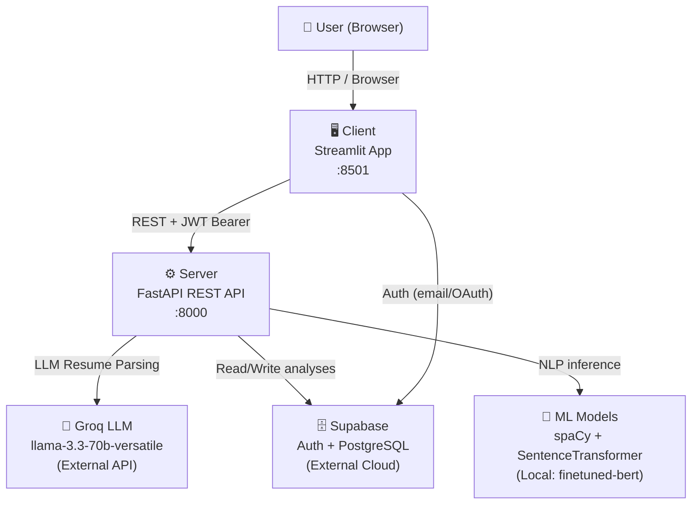
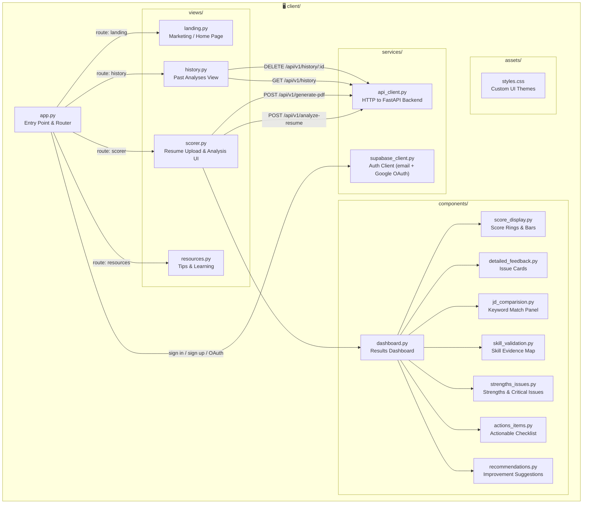
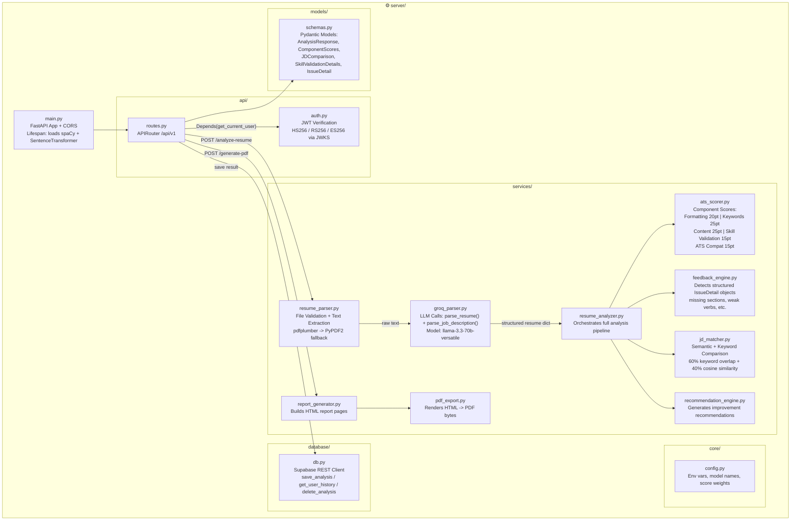
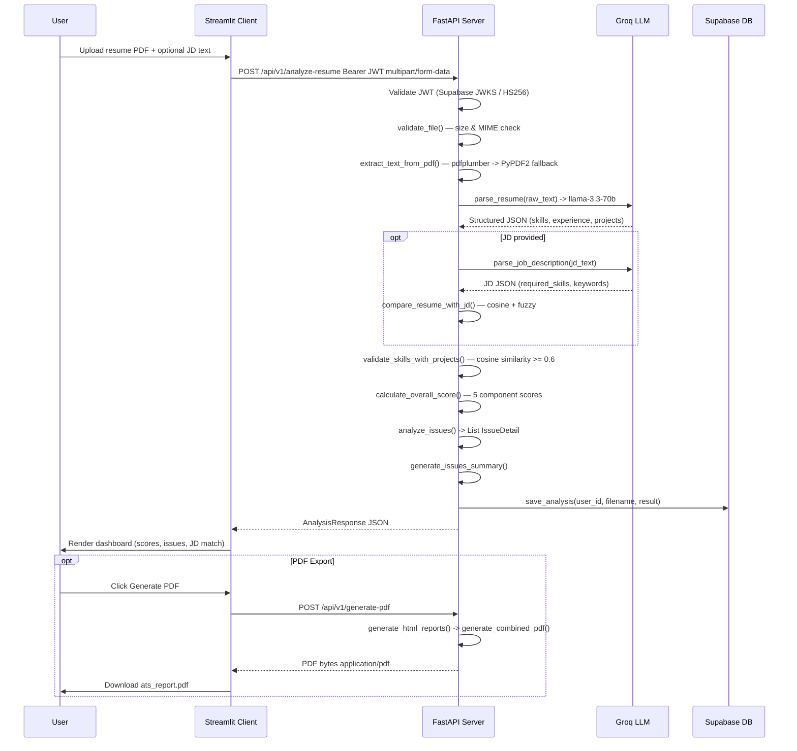
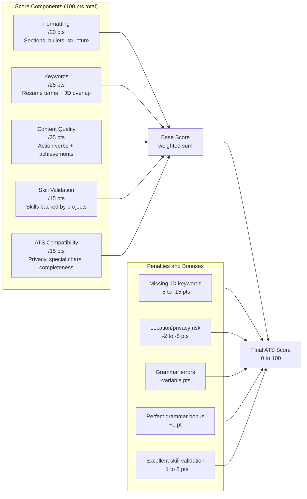
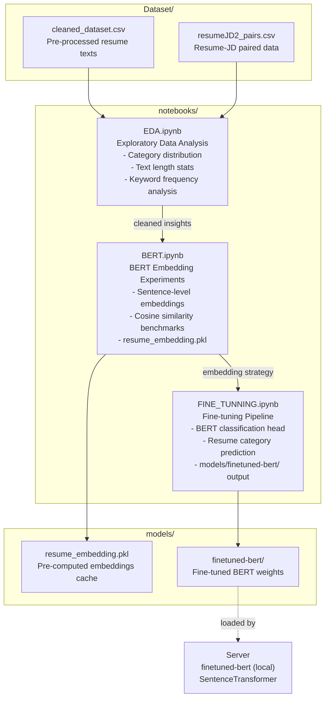
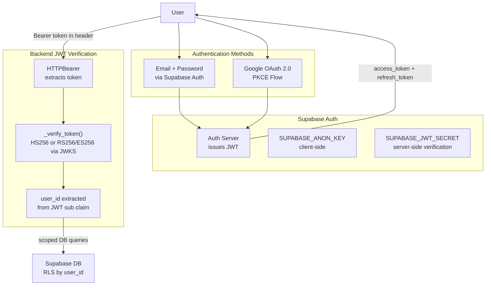

# 🏗️ System Architecture — Stackscore ATS Resume Checker

---

## 1. High-Level System Overview

---

## 2. Client Architecture (Streamlit)

---

## 3. Server Architecture (FastAPI)

---

## 4. Analysis Pipeline (Request Flow — Sequence Diagram)

---

## 5. Scoring Model

---

## 6. Notebook Pipeline (ML Research)

---

## 7. Authentication Flow

